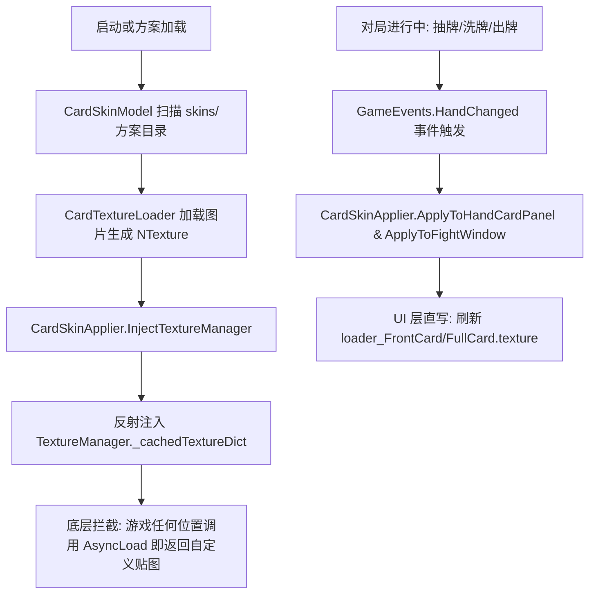

# CardSkinMod (手牌卡面与游戏卡片自定义皮肤模组)

基于 **CesiumLoader** 模组加载器开发，为《星穹派对》（Astral Party）提供自定义手牌卡面、命运卡、事件卡贴图替换及多皮肤方案管理功能。

---

## 1.1.1 行为说明

- 静态异画、视频异画及对应异画图标全部保留原版，不会被基础卡牌皮肤或异画文件覆盖。
- 普通手牌、事件、命运和地图事件仍可替换；大厅图鉴与放大预览也支持，场景切换后自动恢复缓存。
- `ForceFullCard` 仅改变允许替换的普通卡面布局，不会修改游戏的异画或视频显示状态。
- 修改配置或皮肤后完全退出游戏并重启。实际配置文件为模组目录中的 `config.json`。

## 目录
- [1. 核心特性与架构设计](#1-核心特性与架构设计)
- [2. 代码工程结构](#2-代码工程结构)
- [3. 游戏内卡面渲染与注入原理](#3-游戏内卡面渲染与注入原理)
- [4. 皮肤方案目录与文件命名规范](#4-皮肤方案目录与文件命名规范)
- [5. 配置说明 (mod.cfg)](#5-配置说明-modcfg)
- [6. 开发、编译与测试指南](#6-开发编译与测试指南)
- [7. 配套工具脚本](#7-配套工具脚本)
- [8. 交接开发待办与进阶方向](#8-交接开发待办与进阶方向)

---

## 1. 核心特性与架构设计

1. **多格式贴图加载**：
   - 支持 `.png`、`.jpg`、`.jpeg`、`.bmp` 等主流图片格式。
   - 自动生成 Unity 原生 `Texture2D` 并包装为 FairyGUI `NTexture`。
2. **多方案管理与一键切换**：
   - 皮肤按方案存放于独立目录：`AstralParty_ModLoader/skins/<方案名称>/`。
   - 配置文件支持指定启动方案 `ActiveSkin`。
3. **优雅回退机制 (Graceful Fallback)**：
   - 如果某个方案中只替换了部分卡片，未指定的卡牌会自动回退至游戏原版卡面，无需将全量卡面拷贝完整即可工作。
4. **底层与表现层双重注入**：
   - **底层**：注入 `TextureManager._cachedTextureDict`，使游戏全局所有卡面引用（手牌、图鉴、出牌动画、弃牌、商店、命运卡等）均优先采用自定义贴图。
   - **表现层**：监听 `GameEvents.HandChanged` 并在对局刷新时直接注入 `UIHandCardPanel` 与 `FightWindow`，保证出牌、洗牌、抽牌时即时生效。
5. **比例自适应与全图卡支持**：
   - 原版 $404 \times 400$ 卡面保持标准边框。
   - 用户导入的长图（高宽比 $>1.15$）自动切换至全图异画卡（Full Card）模式展示。也可配置 `ForceFullCard=true` 强制所有卡片采用全图展示。
6. **纯逻辑与 Unity 解耦**：
   - 数据索引模型（`CardSkinModel`）完全脱机无 Unity 依赖，配有完整的 XUnit 单元测试套件。

---

## 2. 代码工程结构

```
modding/msvc/
├── mods/CardSkinMod/                        # 模组主工程
│   ├── CardSkinMod.csproj                   # 项目工程文件 (netstandard2.0)
│   ├── CardSkinMod.json                     # 模组清单元数据 (Manifest)
│   ├── ModEntry.cs                          # 模组生命周期入口 (ModBase)
│   ├── CardSkinModel.cs                     # 皮肤方案扫描、ID解析与索引模型
│   ├── CardTextureLoader.cs                 # 磁盘贴图读取与 FairyGUI NTexture 封装
│   ├── CardSkinApplier.cs                   # 全局缓存注入与 UI 控件贴图刷新
│   └── README.md                            # 本文档
│
├── tests/CardSkinMod.Tests/                 # 单元测试工程
│   ├── CardSkinMod.Tests.csproj             # 测试工程 (net8.0 + xUnit)
│   └── CardSkinModelTests.cs                # 索引、回退、SFW识别单测试用例
│
└── tools/
    ├── tag_card_skins.py                    # 皮肤编号角标生成工具 (Python)
    └── builtin-mods.json                    # 预置模组构建列表
```

---

## 3. 游戏内卡面渲染与注入原理

### 3.1 游戏原有渲染流程
1. 游戏配置表 `CardInfoConfigure`、`DestinyInfoConfigure`、`EventInfoConfigure` 中记录了资源素材的 `AssetKey`（例如 `UT_HandCard_10001`、`UT_Destiny_40001`）。
2. UI 渲染方法 `CommonUIManager.RendererCardContent` 将卡牌组件的 `loader_FrontCard.url` 或 `loader_FullCard.url` 赋值为对应的 `AssetKey`。
3. 组件内部的 `TextureLoader` 继承自 FairyGUI `GLoader`，在 `LoadExternal()` 中调用 `SimpleSingletonProvider<TextureManager>.inst.AsyncLoad(url)`。
4. `TextureManager` 维护了 `_cachedTextureDict`（字典结构 `Dictionary<string, NTexture>`）：
   - 若字典命中缓存且未被释放，**直接返回缓存纹理，跳过 Addressables 资源包读取**。
   - 若未命中，才会从 Addressables 异步下载或读取原版 AssetBundle。

### 3.2 模组注入策略


- **防止贴图被 GC/释放**：在生成 `NTexture` 时设置 `nTex.destroyMethod = DestroyMethod.None`，避免在切关卡或窗口重构时被 FairyGUI 意外销毁。
- **动态全图状态控制**：操作 `UICom_Card.frontState.selectedIndex`（`0`=半身卡框，`2`=全图异画卡）。

---

## 4. 皮肤方案目录与文件命名规范

### 4.1 目录结构
所有皮肤方案存放于游戏根目录的 `AstralParty_ModLoader/skins/` 下，每个子目录为一个独立的方案：
```
AstralParty_ModLoader/
└── skins/
    ├── default/                    # 默认方案 (游戏原版贴图合集)
    │   ├── skin.json               # [可选] 方案元数据
    │   ├── UT_HandCard_10001.png   # 冲刺卡
    │   ├── UT_HandCard_10002.png   # 能量盾
    │   ├── UT_HandCard_10006.png
    │   ├── UT_HandCard_10006_sfw.png
    │   ├── UT_Destiny_40001.png    # 命运卡
    │   └── ...
    │
    └── anime_custom/               # 用户自定义方案
        ├── skin.json
        ├── 10001.png               # 可直接用纯数字命名
        ├── 能量盾.png              # 也可用卡牌中文名命名
        └── UT_Destiny_40001.png
```

### 4.2 方案元数据 `skin.json` (可选)
```json
{
  "name": "二次元动漫卡面",
  "author": "Modder",
  "description": "精选手绘风格手牌卡面与命运卡方案"
}
```

### 4.3 卡面图片命名匹配规则
模组按以下优先级依次匹配自定义卡面（支持大小写无关）：
1. **纯数字卡牌 ID**：`10001.png`、`40001.jpg`
2. **带官方前缀的文件名**（自动剥离前缀匹配卡牌 ID）：
   - 手牌卡：`UT_HandCard_10001.png`
   - 命运卡：`UT_Destiny_40001.png`
   - 事件卡：`UT_Event_30001.png`
   - 地图事件：`UT_MapEvent_31001.png`
   - 异画道具前缀 `UT_Item_AltArt_*`、`UT_IAltArt_*` 会被跳过，保留游戏原版。
3. **天使模式/审查后缀**：`UT_HandCard_10006_sfw.png`
4. **完整 Unity AssetKey 映射**：任何以游戏内对应素材 Key 命名的图片将直接以原始 Key 注入全局缓存。
5. **卡牌中文名称匹配**：例如 `加速卡.png`、`换位卡.png`（根据游戏本地化名称检索）。

### 4.4 图片规格建议
- **标准半图卡面**：建议分辨率 **$404 \times 400$**（或类似 1:1 比例），将展示在卡牌边框内部。
- **全图大卡 / 异画卡**：建议分辨率 **$404 \times 560$**（或 9:16、5:7 比例的长图），模组将自动扩展为全图展示。

---

## 5. 配置说明 (mod.cfg)

配置文件位于 `AstralParty_ModLoader/mods/CardSkinMod/mod.cfg`：

```ini
[CardSkinMod]
# 是否启用本模组
Enabled = true

# 当前使用的皮肤方案子目录名称 (对应 AstralParty_ModLoader/skins/<ActiveSkin>/)
ActiveSkin = default

# 是否强制所有卡面均以全图卡 (异画模式) 展示 (默认 false，false 时长图会自动全图，方形图保持原框)
ForceFullCard = false
```

---

## 6. 开发、编译与测试指南

### 6.1 开发环境
- Windows 10/11
- .NET SDK 8.0 或更高版本
- Visual Studio 2022 或 VS Code / JetBrains Rider

### 6.2 编译命令
在工程根目录下执行：
```powershell
# 运行单元测试
dotnet test modding/msvc/tests/CardSkinMod.Tests/CardSkinMod.Tests.csproj

# 编译模组 Release 版本
dotnet build modding/msvc/mods/CardSkinMod/CardSkinMod.csproj -c Release
```

### 6.3 部署产物
编译成功后，产物位于 `modding/msvc/mods/CardSkinMod/bin/Release/netstandard2.0/`：
- `CardSkinMod.dll`
- `CardSkinMod.json`

将上述两项部署到：
- 游戏目录：`C:\Program Files (x86)\Steam\steamapps\common\Astral Party\8vJXn6CN\AstralParty_ModLoader\mods\CardSkinMod\`
- 本地分发目录：`modding/msvc/dist/modloader/AstralParty_ModLoader/mods/CardSkinMod/`

---

## 7. 配套工具脚本

### 编号水印工具 (`modding/msvc/tools/tag_card_skins.py`)
在测试自制皮肤时，为了确认游戏是否真正读取了外部贴图，可使用该工具自动在每张卡面右上角绘制显眼的红底白字卡牌编号角标（如 `#10001`、`#30001`）：

```powershell
# 处理皮肤目录下所有新增/未打标的图片
python modding/msvc/tools/tag_card_skins.py

# 强制重新打标全部图片
python modding/msvc/tools/tag_card_skins.py --all
```

---

## 8. 交接开发待办与进阶方向

如果你接手本项目，以下为已规划或推荐的下一步开发任务：

1. **Toys 桌面助手集成 (优先推进)**：
   - 在 `replaytool/src/AstralParty.Toys` 中提供 UI 交互界面：
     - 列出 `AstralParty_ModLoader/skins/` 下的所有皮肤方案。
     - 支持下拉框选择并切换 `ActiveSkin`。
     - 支持在 Toys 中点击卡牌查看当前皮肤贴图预览。
     - 支持“新建方案”并一键打开方案目录。
2. **局内热重载 (Hot-Reload)**：
   - 监听配置文件变化或添加快捷键（例如 `F7`），在不重启游戏的情况下清空已注入的贴图缓存并重新从磁盘读取。
3. **WebP / 动图格式扩展**：
   - 目前 Unity 2021 `Texture2D.LoadImage` 原生支持 PNG/JPG。
   - 若后续需要支持 WebP 静态图或 GIF/APNG 动图卡面，可通过 P/Invoke 调用 libwebp 或接入 HybridCLR 兼容解码库。
4. **卡背 (Card Back) 自定义扩展**：
   - 目前已有卡背配置表 `StaticConfigure.Fashion.CardBackDict`。可复用本模组的贴图加载逻辑，扩展支持自定义卡背方案。
